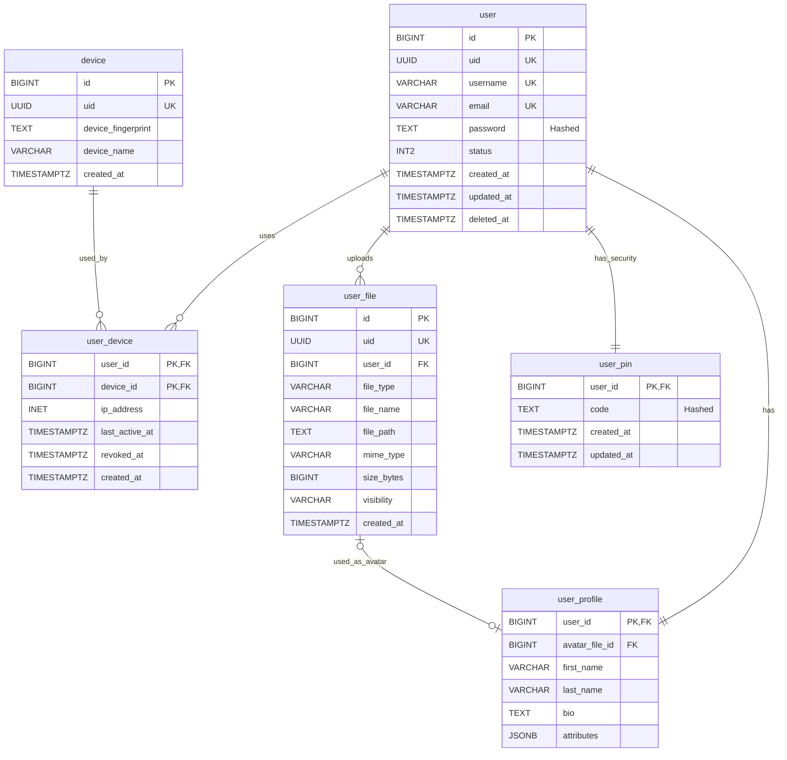

# Service User Database

Database schema and migration source of truth for the User domain.

## Table of Contents

- [Overview](#overview)
- [Database Schema](#database-schema)
- [Migration Structure](#migration-structure)
- [Environment Variables](#environment-variables)
- [Running Liquibase](#running-liquibase)

## Overview

This repository contains the database schema and migration scripts for the Service User domain. It is used as the source of truth for the database schema and migration scripts.

## Database Schema



## Migration Structure

The migrations are managed via **Liquibase** and are located in the `changes/` directory.
The execution order is defined in `master.yml`.

| File                                | Description                                                         | ID Prefix |
| :---------------------------------- | :------------------------------------------------------------------ | :-------- |
| `001-create-user-tables.yml`        | Creates `user` and `user_pin` tables.                               | `001-XX`  |
| `002-create-device-tables.yml`      | Creates `device` and `user_device` tables.                          | `002-XX`  |
| `003-create-file-tables.yml`        | Creates `user_file` table.                                          | `003-XX`  |
| `004-create-user-profile-table.yml` | Creates `user_profile` table (Dependant on `user` and `user_file`). | `004-XX`  |

## Environment Variables

The following environment variables are required to run Liquibase (or provided via `.env`):

- `DATABASE_URL`: The URL of the database to connect to (e.g. `jdbc:postgresql://host:port/db`).
- `DATABASE_USER`: The username to use when connecting to the database.
- `DATABASE_PASSWORD`: The password to use when connecting to the database.

## Running Liquibase

You can use the provided `Makefile` or run via docker:

```bash
# Check status
make status

# Run update (apply migrations)
make update
```
